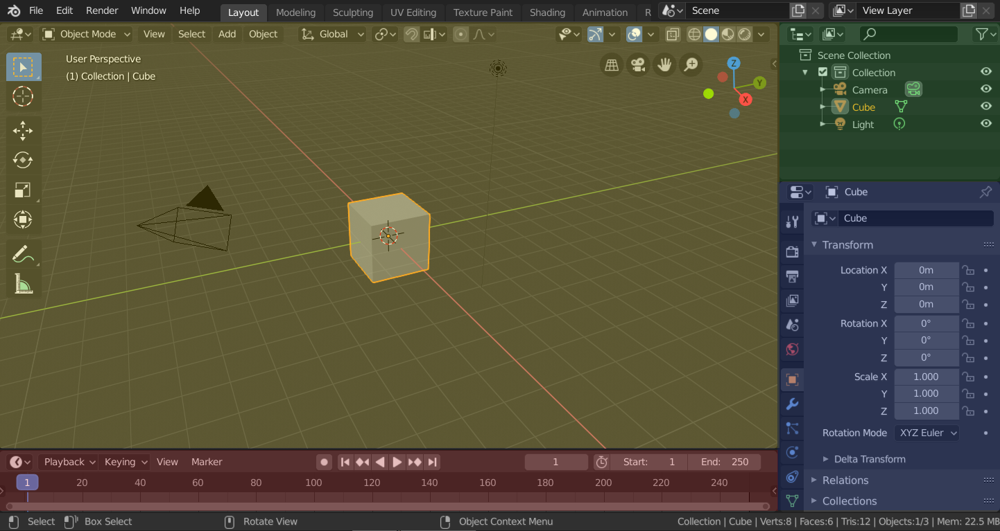

# From Concept Art to Stunning 3D Game Assets

# Introduction

In the realm of game development and digital content creation, transforming a creative idea into a functional and visually striking 3D asset is a critical skill that can elevate your projects to a professional level. This tutorial will guide you step-by-step through the entire process of creating a 3D weapon, starting from a simple concept sketch to its final integration into a Horizon World Desktop Editor. Whether you're a beginner in 3D modeling or an experienced creator looking to streamline your workflow, you'll learn practical techniques and accessible tools to bring your visions to life. We’ll use industry-standard software like Blender for modeling, texturing and paiting and finally import the result into the Horizon World Desktop Editor, Meta’s platform for building immersive metaverse experiences. Get ready to unleash your creativity and craft assets that not only look stunning but are also optimized for games and virtual environments.

This repository was created to show a tutorial on how to create a 3D model in Blender from a reference image, to which texture painting is applied manually. It can then be imported into the Horizon World Desktop Editor in FBX format to be used as part of any virtual world you want to develop. 

# Requirements
* Blender 2.93
* Horizon World Desktop Editor
* Reference image that will be used to create our 3D model.

# TIPS

Consider that working with Blender can be a challenging task, however, let me tell you a trick to help you progress more quickly in creating your own 3D model: one hand on the keyboard and one hand on the mouse. This is because Blender works with keyboard shortcuts to implement different techniques that will be used extensively throughout this tutorial. You'll find that some shortcuts are applied repeatedly, allowing you to gradually memorize them and feel more comfortable with the work environment.

## Default Workspaces

Blender’s default startup shows the “Layout” workspace in the main area. This workspace is a general workspace to preview your scene and contains the following Editors:

* 3D Viewport on top left.
* Outliner on top right.
* Properties on bottom right.
* Timeline on bottom left.

